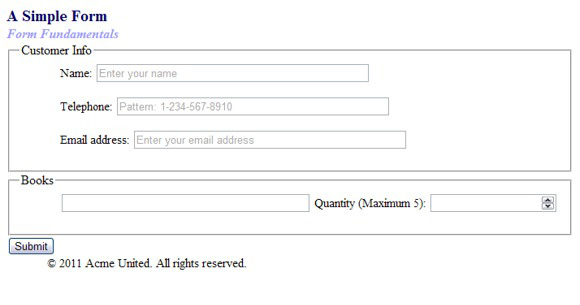
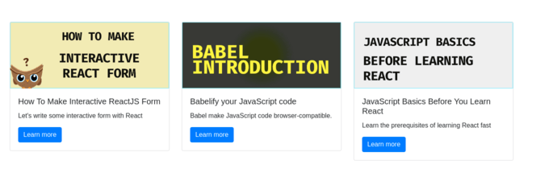
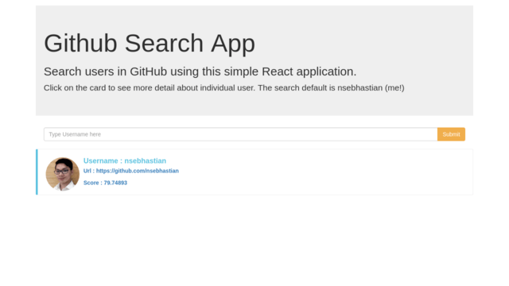
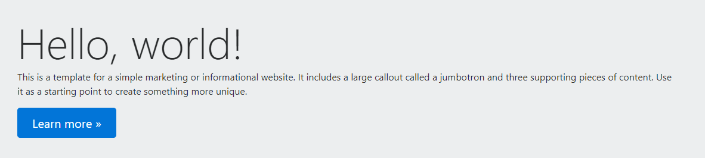
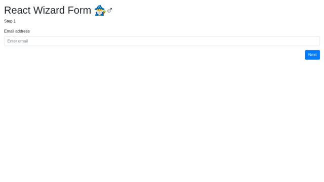

### CodeCamp # 5  
Nattharika Cheepandung  
 
 

# Codecamp Practice Problem (Oak Code Kata)

## Subject

 1. HTML basics exercises [single file]  
    - [ ] Create a webpage that prints your name to the screen.
    - [ ] create a webpage that prints the numbers 1 - 10 to the screen.
    - [ ] Create a webpage and set its title to "This is a webpage".
    - [ ] Create a webpage that prints any text of your choosing to the screen, do not include a head section in the code.
    - [ ] Create webpage that prints the message "When was this webpage created? Check page's title for the answer." to the screen, and set the title of the page to the current date.
    - [ ] Create a webpage that prints any text of your choosing to the screen, but this time include a head section in the code.
 1. HTML text exercises [single file] 
    - [ ] Print your name in green.
    - [ ] Print the numbers 1-10, each number being a different color.
    - [ ] Prints your name in a Tahoma font.
    - [ ] Print a paragraph with 4 - 5 entences. Each sentence should be a different font.
    - [ ] Print a paragraph that is a description of a book as well as its author.Names and title should be underlined, adjectives should be italicized and bolded.
    - [ ] Print your name to the screen with every letter being a different heading size.
 1. HTML text formatting exercises [single file]  
    - [ ] Print the squares of the number 1 - 20. Each number should be on a separate line, next to it the number 2 superscripted, an equal sign and the result. (Example: 102 = 100)
    - [ ] Prints 10 name with a line break between each name. The list should be alphabetized, and to do this place a subscripted number next to each name based on where it will go in the alphabetized list. (Example: Alan1). Print first, the unalphabetized list with a subscript number next to each name, then the alphabetized list. Both list should have an `<h1>` level heading.
    - [ ] Print two paragraphs that are both indented using the `&nbsp;` command.
    - [ ] Print two lists with any information you want. One lish should be an ordered list, the other list should be an unordered list.
    - [ ] Prints an h1 level heading followed by a horizontal line whose width is 100%. Below the horizontal line print a paragraph relating to the text in the heading.
    - [ ] Print some preformatted text of your choosing. (hint: use the `<pre>` tag).
    - [ ] Print a long quote and a short quote. Cite the author of each quote.
    - [ ] Print some deleted and inserted text of your choosing.
    - [ ] Print a definition list with 5 items.
    - [ ] Print two addresses in the same format used on the front of envelopes (senders address in top left corner, receivers address in the center).
    - [ ] Print ten acronyms and abbreviations of your choosing, each separated by two lines. Specify the data that abbreviations and acronyms represent.
 1. HTML link exercises [single file] 
    - [ ] Create some links to various search engines (google, yahoo, altavista, lycos, etc.).
    - [ ] Create links to five different pages on five different websites that should all open in a new window.
    - [ ] Create a page with a link at the top of it that when clicked will jump all the way to the bottom of the page.
    - [ ] Create a page with a link at the bottom of it that when clicked will jump all the way to the top of the page.
    - [ ] Create a page with a link at the top of it that when clicked will jump all the way to the bottom of the page. At the bottom of the page there should be a link to jump back to the top of the page.
 1. HTML image exercises [single file] 
    - [ ] Display five different images. Skip two lines between each image. Each image should have a title.
    - [ ] Display an image that has a border of size 2, a width of 200, and a height of 200.
    - [ ] Display an image that when clicked will link to a search engine of your choice (should be opened in a new window).
    - [ ] Display an image that when clicked will link to itself and will display the image in the browser by itself.
 1. HTML Form  [single file] 
    - [ ] ทำหน้า Form Register    
    - [ ] บทเรียนเสริม อ่าน Best Practice การใช้ [Form](https://code.tutsplus.com/tutorials/20-html-forms-best-practices-for-beginners--net-6593)
 1. HTML Project [3 Project] 
    - [ ] Project 1 HTML Tribute Page Project. 
        Credit : เอามาจาก [freeCodeCamp.org](https://www.freecodecamp.org/learn/responsive-web-design/responsive-web-design-projects/build-a-tribute-page)  
        

        
see more...
   
            <b>โจทย์</b>  
                &emsp;- ให้ทำ HTML และ CSS เพื่อทำหน้าเว็บไซต์ ประวัติผู้เสียชีวิต ให้เหมือนหน้าเว็บนี้ <a href="https://codepen.io/freeCodeCamp/full/zNqgVx">FCC: Tribute Page </a>  
                &emsp;- สามารถเปลี่ยนเป็นประวัติของใครก็ได้   
            <b>ข้อกำหนด</b> (Code จะต้องมีองค์ประกอบต่อไปนี้)  
            &emsp;<u>User Story #1</u>: My tribute page should have an element with a corresponding id="main", which contains all other elements. 
            &emsp;<u>User Story #2</u>: I should see an element with a corresponding id="title", which contains a string (i.e. text) that describes the subject of the tribute page (e.g. "Dr. Norman Borlaug"). 
            &emsp;<u>User Story #3</u>: I should see a div element with a corresponding id="img-div". 
            &emsp;<u>User Story #4</u>: Within the img-div element, I should see an img element with a corresponding id="image". 
            &emsp;<u>User Story #5</u>: Within the img-div element, I should see an element with a corresponding id="img-caption" that contains textual content describing the image shown in img-div. 
            &emsp;<u>User Story #6</u>: I should see an element with a corresponding id="tribute-info", which contains textual content describing the subject of the tribute page. 
            &emsp;<u>User Story #7</u>: I should see an a element with a corresponding id="tribute-link", which links to an outside site that contains additional information about the subject of the tribute page. HINT: You must give your element an attribute of target and set it to _blank in order for your link to open in a new tab (i.e. target="_blank"). 
            &emsp;<u>User Story #8</u>: The img element should responsively resize, relative to the width of its parent element, without exceeding its original size. 
            &emsp;<u>User Story #9</u>: The img element should be centered within its parent element.  
        
 
    - [ ] Project 2 HTML Form Validation Project 
         
        ที่มา [IBM Developer](https://www.ibm.com/developerworks/library/wa-create-pr/) 
        
  
            
see more...

                &emsp;- โจทย์ที่ 1 ทำ Form ให้เหมือนเป๊ะ ตาม file รูป image.png  
                &emsp;- โจทย์ที่ 2 ใส่ Attribute อื่นๆ และ condition อื่นๆ สำหรับ Form  
                &emsp;&emsp;* Code the form with autocomplete active.  
                &emsp;&emsp;* Given the image shown in Figure 1, it is easy to see that two field sets are used to create the main structure of the form. Your task is to create the field sets, including the names Customer Info and Books. Don't worry about the content fields for the moment.  
                &emsp;&emsp;* The Name field you create should have autofocus, placeholder text, and be required. Don't forget to select the appropriate type for this field as well as all the fields that follow.  
                &emsp;&emsp;* The Telephone field should have placeholder text, a pattern to restrict entry, and be required.  
                &emsp;&emsp;* The Email address field should have placeholder text and allow multiple entries. This field should also be required.  
                &emsp;&emsp;* The Books field should have a data list. You can select the content you would like to list.  
                &emsp;&emsp;* The Quantity (Maximum 5) field should have a minimum value of 1 and a maximum value of 5.  
        
 
    - [ ] Project 3 Personal Portfolio Website 
        ที่มา [freeCodeCamp.org](https://www.freecodecamp.org/learn/responsive-web-design/responsive-web-design-projects/build-a-personal-portfolio-webpage)
        

            
see more...
 
            <b>Condition ที่ต้องทำ</b>  
            &emsp;<u>User Story #1</u>: My portfolio should have a welcome section with an id of welcome-section. 
            &emsp;<u>User Story #2</u>: The welcome section should have an h1 element that contains text. 
            &emsp;<u>User Story #3</u>: My portfolio should have a projects section with an id of projects. 
            &emsp;<u>User Story #4</u>: The projects section should contain at least one element with a class of project-tile to hold a project. 
            &emsp;<u>User Story #5</u>: The projects section should contain at least one link to a project. 
            &emsp;<u>User Story #6</u>: My portfolio should have a navbar with an id of navbar. 
            &emsp;<u>User Story #7</u>: The navbar should contain at least one link that I can click on to navigate to different sections of the page. 
            &emsp;<u>User Story #8</u>: My portfolio should have a link with an id of profile-link, which opens my GitHub or FCC profile in a new tab. 
            &emsp;<u>User Story #9</u>: My portfolio should have at least one media query. 
            &emsp;<u>User Story #10</u>: The height of the welcome section should be equal to the height of the viewport. 
            &emsp;<u>User Story #11</u>: The navbar should always be at the top of the viewport.  
        
 
 1. HTML CSS Project  
    - [ ] Web ข่าว 1 หน้า
        

            
see more...

            ไปที่ <a href="https://www.newsweek.com/">Newsweek</a>  
            แล้วใช้ Bootstrap ในการสร้าง Website นี้ขึ้นมา โดยให้รองรับทั้งแบบ Desktop และแบบ Mobile Website  
            หมายเหตุ : ให้ใช้เทคโนโลยีอะไรก็ได้ที่เราถนัด
        
 
 1. Super Javascript Practice  
    - [ ] ไปทำโจทย์ที่ Freecodecamp
        
 
            
ขั้นตอน
  
                1. ไปที่ freeCodeCamp.org  
                2. ทำโจทย์ของ "JavaScript Algorithms and Data Structures Certification (300 hours)" ในหัวข้อต่อไปนี้  
                    &emsp;&emsp;2.1. Basic JavaScript 
                    &emsp;&emsp;2.2. ES6 
                    &emsp;&emsp;2.3. Debugging 
                    &emsp;&emsp;2.4. Basic Data Structures 
                    &emsp;&emsp;2.5. Basic Algorithm Scripting 
                    &emsp;&emsp;2.6. Object Oriented Programming  
        

        
 
            
วิธีการส่ง
  
                1. Capture หน้าจอ  
                2. นำภาพไปไว้ใน <a href="http://readme.md/">README.md</a>  
                3. เขียนสรุป 2-3 บรรทัด ว่าได้เรียนรู้อะไรจากการทำโจทย์ และสามารถนำไปปรับใช้อย่างไรในหารพัฒนาโปรเจค   
                <u>ตัวอย่างการเขียน</u>&nbsp; <a href="http://readme.md/">README.md</a>  
                <a href="https://github.com/Asabeneh/30DaysOfJavaScript">GitHub - Asabeneh/30-Days-Of-JavaScript</a>: 30 days of JavaScript programming challenge is a step-by-step guide to learn JavaScript programming language in 30 days. 
                This challenge may take more than 100 days, please just follow your own pace.  These videos may help too: <a href="https://www.youtube.com/channel/UC7PNRuno1rzYPb1xLa4yktw">https://www.youtube.com/channel/UC7PNRuno1rzYPb1xLa4yktw </a>  
        
 
 1. React Project  
    - [ ] ทำ project - Front-end fun with list of cards. 
    
        

Description

            <a href="https://hackernoon.com/hands-on-projects-to-learn-the-basics-of-react-3a06726514a8#1ff5">Hands-on projects to learn the basics of React</a>
        
 
    - [ ] ทำ project - GitHub Search App 
        
        

Description

            <a href="https://hackernoon.com/hands-on-projects-to-learn-the-basics-of-react-3a06726514a8#1ff5">Hands-on projects to learn the basics of React</a>
        
 
    - [ ] ทำ project - Search and Filter List Records - <a href="http://demo11.downloader.tech/"> หน้าตาแบบนี้</a>
        

Description

            <a href="https://www.golangprograms.com/react-js-projects-for-beginners/search-and-filter-list-records.html">React JS - Search and Filter List Records in React JS  - golangprograms.com</a>
        
 
 1. React Advance  
    - [ ] [ลองใช้ react form](https://github.com/redux-form/redux-form)
    - [ ] [ลอง material ui react](https://github.com/mui-org/material-ui)
 1. Database  
    - [ ] ฝึกทำโจทย์ Retrieve data from tables 
        ไปที่ที่นี่ [SQL Exercises: Retrieve data from tables - w3resource](https://www.w3resource.com/sql-exercises/sql-retrieve-from-table.php) 
    - [ ] Wildcard and Special operators 
        ฝึกทำโจทย์ [SQL Exercises - Wildcard and Special operators - w3resource](https://www.w3resource.com/sql-exercises/sql-wildcard-special-operators.php)
    - [ ] Aggregate Functions 
        ฝึกทำโจทย์ [Functions and Group by - Exercises, Practice, Solution](https://www.w3resource.com/sql-exercises/sql-aggregate-functions.php)
    - [ ] Formatting query output 
        ฝึกทำโจทย์ [Formatting Output  - Exercises, Practice, Solution](https://www.w3resource.com/sql-exercises/sql-fromatting-output-exercises.php)
    - [ ] Query on Multiple Tables 
        ฝึกทำโจทย์ [SQL Query on Multiple Tables - Exercises, Practice, Solution - w3resource](https://www.w3resource.com/sql-exercises/sql-exercises-quering-on-multiple-table.php)
    - [ ] SQL JOINS 
        ฝึกทำโจทย์ [SQL JOINS - Exercises, Practice, Solution - w3resource](https://www.w3resource.com/sql-exercises/sql-joins-exercises.php)
    - [ ] SUBQUERIES 
        ฝึกทำโจทย์ [SQL SUBQUERIES - Exercises, Practice, Solution - w3resource](https://www.w3resource.com/sql-exercises/subqueries/index.php)
    - [ ] FILTERING and SORTING on HR Database
        ฝึกทำโจทย์ [HR Database - SORT FILTER: Exercises, Practice, Solution](https://www.w3resource.com/sql-exercises/sorting-and-filtering-hr/index.php)
    - [ ] Movie Database Basic
        ฝึกทำโจทย์ [SQL exercises on movie Database - Exercises, Practice, Solution - w3resource](https://www.w3resource.com/sql-exercises/movie-database-exercise/basic-exercises-on-movie-database.php)
    - [ ] Project - ออกแบบ Database Web ข่าว 
        

        
see more...

            จาก Project ก่อนหน้า Web ข่าว 1 หน้า
            HTML CSS PROJECT
            ที่เราสร้างเว็บข่าวด้วย HTML + CSS  
            &emsp;- คราวนี้ให้ออกแบบ Database ด้วย ER Diagra 
            &emsp;- จากนั้นแปลง ER Diagram เป็น Database Schema 
            &emsp;- จากนั้น นำ Database Schema ไปสร้างใน MySQL 
            &emsp;- จากนั้น เขียน Code ด้วย NodeJS เพื่อให้ต่อกับ Database Mysql ได้  
        

        
 
            
วิธีการส่ง
  
                1. Capture หน้าจอ  
                2. นำภาพไปไว้ใน <a href="http://readme.md/">README.md</a>  
                3. เขียนสรุป 2-3 บรรทัด ว่าได้เรียนรู้อะไรจากการทำโจทย์ และสามารถนำไปปรับใช้อย่างไรในหารพัฒนาโปรเจค   
                <u>ตัวอย่างการเขียน</u>&nbsp; <a href="http://readme.md/">README.md</a>  
                <a href="https://github.com/Asabeneh/30DaysOfJavaScript">GitHub - Asabeneh/30-Days-Of-JavaScript</a>: 30 days of JavaScript programming challenge is a step-by-step guide to learn JavaScript programming language in 30 days. 
                This challenge may take more than 100 days, please just follow your own pace.  These videos may help too: <a href="https://www.youtube.com/channel/UC7PNRuno1rzYPb1xLa4yktw">https://www.youtube.com/channel/UC7PNRuno1rzYPb1xLa4yktw </a>  
        
 
 1. Optional  
    - [ ] nodejs ทำตามไอ้นี่ จนถึงเรื่อง streaming
        

see more...

            <b>Description</b> 
            &emsp;ทำให้ครบ จนถึงเรื่อง streaming 
            &emsp;<a href="https://github.com/maxogden/art-of-node/#the-art-of-node">GitHub - maxogden/art-of-node: :snowflake: a short introduction to node.js</a> 
        

        
 
                
วิธีการส่ง
  
                    1. Capture หน้าจอ  
                    2. นำภาพไปไว้ใน <a href="http://readme.md/">README.md</a>  
                    3. เขียนสรุป 2-3 บรรทัด ว่าได้เรียนรู้อะไรจากการทำโจทย์ และสามารถนำไปปรับใช้อย่างไรในหารพัฒนาโปรเจค   
                    <u>ตัวอย่างการเขียน</u>&nbsp; <a href="http://readme.md/">README.md</a>  
                    <a href="https://github.com/Asabeneh/30DaysOfJavaScript">GitHub - Asabeneh/30-Days-Of-JavaScript</a>: 30 days of JavaScript programming challenge is a step-by-step guide to learn JavaScript programming language in 30 days. 
                    This challenge may take more than 100 days, please just follow your own pace.  These videos may help too: <a href="https://www.youtube.com/channel/UC7PNRuno1rzYPb1xLa4yktw">https://www.youtube.com/channel/UC7PNRuno1rzYPb1xLa4yktw </a>  
            
 
    - [ ] อ่านวิธีการใช้งาน Bootstrap และเรื่องทั่วๆ ไป  
        

see more...

            <b>Description</b> 
                &emsp;อ่านที่นี่ <a href="https://www.designil.com/how-to-use-bootstrap-4.html">link</a> 
        
 
    - [ ] อ่านและทำตาม [Tutorial](https://benzneststudios.com/blog/web/bootstrap-4-basic-part-1/) นี้ให้ครบ
    - [ ] [หนังสือภาษาไทย Bootstrap ไว้อ่านเพิ่มเติม](http://infgis.rid.go.th/index.php/2019-11-27-12-07-47/22-18-12-2560)
    - [ ] Project 1 - My Website - 1 หน้า 
         
        

        
see more...
 
            <b>ขั้นตอนการทำ</b> 
            <ol>
                <li> ไปที่นี่ <a href="https://v4-alpha.getbootstrap.com/examples/jumbotron/">Jumbotron Template for Bootstrap</a> แล้ว เลือก view page source แล้ว Download source code ทั้งหมด มา run ให้ได้บน localhost ของตัวเอง (งานนี้) </li>
                <li> ปลี่ยนข้อมูลทั้งหมดในหน้านี้ ให้เป็น Website แนะนำข่าวสารเกี่ยวกับตัวของเราเอง
                เช่น บริเวณ File image.png อาจจะเปลี่ยนเป็น </li>
                <li> Hello, world! เป็น Hi ฉันชื่อ XXX </li>
                <li> This is a template for a simple marketing or informational website. It includes a large callout called a jumbotron and three supporting pieces of content. Use it as a starting point to create something more unique. เปลี่ยนเป็น "Website ของฉันเอง " </li>
            </ol>
             
            <b>สิ่งที่ได้รับจาก Project นี้คือ</b> 
            <ul>
                <li>สามารถ Download Source code คนอื่นมา run ที่เครื่องตัวเองได้</li>
                <li>สามารถเปลี่ยนเนื้อหาของ Source code คนอื่นเป็นเนื้อหาของเราเอาได้ เป็นการฝึกทักษะในการอ่าน Source Code ของคนอื่นๆ</li>
            </ul>
        
 
    - [ ] ทำ project - Getting Complex With Wizard Form 
        
        

        
Description

            <a href="https://hackernoon.com/hands-on-projects-to-learn-the-basics-of-react-3a06726514a8#1ff5">link</a>
        
 
    - [ ] Search auto complete - [หน้าตาแบบนี้](http://demo5.downloader.tech/)  
        

        
Description

            <a href="https://www.golangprograms.com/react-js-projects-for-beginners/search-autocomplete-in-react-js.html">React JS - Search Autocomplete Example in React Js  - golangprograms.com</a>
        
 
    - [ ] ทำ project form container - [หน้าตาแบบนี้](http://demo12.downloader.tech/) 
        

        
Description

            <a href="https://www.golangprograms.com/react-js-projects-for-beginners/simple-form-in-react-js.html">React JS - Simple Form in React JS  - golangprograms.com</a>
        
 
    - [ ] ฝึกฝนฝีมือด้วย React Koan จนหมด (เยอะมาก)  
        

        
Description

            <a href="https://github.com/arkency/reactjs_koans">GitHub - arkency/reactjs_koans: Learn basics of React.js making the tests pass</a>
        

        
 
                
วิธีการส่ง
  
                    1. Capture หน้าจอ  
                    2. นำภาพไปไว้ใน <a href="http://readme.md/">README.md</a>  
                    3. เขียนสรุป 2-3 บรรทัด ว่าได้เรียนรู้อะไรจากการทำโจทย์ และสามารถนำไปปรับใช้อย่างไรในหารพัฒนาโปรเจค   
                    <u>ตัวอย่างการเขียน</u>&nbsp; <a href="http://readme.md/">README.md</a>  
                    <a href="https://github.com/Asabeneh/30DaysOfJavaScript">GitHub - Asabeneh/30-Days-Of-JavaScript</a>: 30 days of JavaScript programming challenge is a step-by-step guide to learn JavaScript programming language in 30 days. 
                    This challenge may take more than 100 days, please just follow your own pace.  These videos may help too: <a href="https://www.youtube.com/channel/UC7PNRuno1rzYPb1xLa4yktw">https://www.youtube.com/channel/UC7PNRuno1rzYPb1xLa4yktw </a>  
        
 
    - [ ] ทำ project form validation - [หน้าตาแบบนี้](http://demo18.downloader.tech/) 
        

        
Description

            <a href="https://www.golangprograms.com/react-js-projects-for-beginners/form-validation-in-react-js.html">React JS - Form Validation in React JS  - golangprograms.com</a>                         
        
 
    - [ ] ลอง [enzyme](https://github.com/airbnb/enzyme)
    - [ ] ลอง [react intl](https://github.com/formatjs/react-intl)
    - [ ] ลอง [mobx](https://github.com/mobxjs/mobx)
    - [ ] Project - สร้างเว็บข่าว ด้วย Database และ EJS 
        

see more...
 
            จาก Project ก่อนหน้า ที่เราสร้างและออกแบบ Database เอาไว้ Project - ออกแบบ Database Web ข่าว DATABASE 
             <b>โจทย์</b> 
            <ol>
                <li>ให้ทำการสร้าง ExpressJS app ด้วย EJS ที่ทำให้เว็บข่าวนี้มีหน้าดังนี้</li>
                <li>หน้า Home - แสดงข่าวทั้งหมดที่ดึงมาจาก Database</li>
                <li>หน้า News Detail - เป็นหน้าดูรายละเอียดของข่าว เช่น อาจจะคล้ายๆ หน้านี้ <a href="https://www.newsweek.com/senators-tune-out-next-week-public-impeachment-hearings-1470477">Senators Say They'll Tune Out Next Week's Public Impeachment Hearings</a></li>
            </ol> 
        
 
    - [ ] เรียนตรง [API & Microservice Certification](https://www.freecodecamp.org/learn) 
     
    

