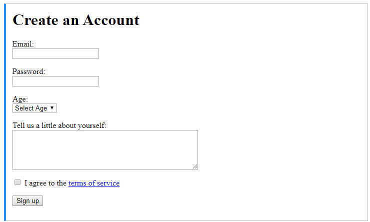

### CodeCamp # 5  
Nattharika Cheepandung  
 
 

# Codecamp Practice Problem (Oak Code Kata)

## Subject

 1. HTML basics exercises [single file]  
    - [ ] Create a webpage that prints your name to the screen.
    - [ ] create a webpage that prints the numbers 1 - 10 to the screen.
    - [ ] Create a webpage and set its title to "This is a webpage".
    - [ ] Create a webpage that prints any text of your choosing to the screen, do not include a head section in the code.
    - [ ] Create webpage that prints the message "When was this webpage created? Check page's title for the answer." to the screen, and set the title of the page to the current date.
    - [ ] Create a webpage that prints any text of your choosing to the screen, but this time include a head section in the code.
 1. HTML text exercises [single file] 
    - [ ] Print your name in green.
    - [ ] Print the numbers 1-10, each number being a different color.
    - [ ] Prints your name in a Tahoma font.
    - [ ] Print a paragraph with 4 - 5 entences. Each sentence should be a different font.
    - [ ] Print a paragraph that is a description of a book as well as its author.Names and title should be underlined, adjectives should be italicized and bolded.
    - [ ] Print your name to the screen with every letter being a different heading size.
 1. HTML text formatting exercises [single file]  
    - [ ] Print the squares of the number 1 - 20. Each number should be on a separate line, next to it the number 2 superscripted, an equal sign and the result. (Example: 102 = 100)
    - [ ] Prints 10 name with a line break between each name. The list should be alphabetized, and to do this place a subscripted number next to each name based on where it will go in the alphabetized list. (Example: Alan1). Print first, the unalphabetized list with a subscript number next to each name, then the alphabetized list. Both list should have an `<h1>` level heading.
    - [ ] Print two paragraphs that are both indented using the `&nbsp;` command.
    - [ ] Print two lists with any information you want. One lish should be an ordered list, the other list should be an unordered list.
    - [ ] Prints an h1 level heading followed by a horizontal line whose width is 100%. Below the horizontal line print a paragraph relating to the text in the heading.
    - [ ] Print some preformatted text of your choosing. (hint: use the `<pre>` tag).
    - [ ] Print a long quote and a short quote. Cite the author of each quote.
    - [ ] Print some deleted and inserted text of your choosing.
    - [ ] Print a definition list with 5 items.
    - [ ] Print two addresses in the same format used on the front of envelopes (senders address in top left corner, receivers address in the center).
    - [ ] Print ten acronyms and abbreviations of your choosing, each separated by two lines. Specify the data that abbreviations and acronyms represent.
 1. HTML link exercises [single file] 
    - [ ] Create some links to various search engines (google, yahoo, altavista, lycos, etc.).
    - [ ] Create links to five different pages on five different websites that should all open in a new window.
    - [ ] Create a page with a link at the top of it that when clicked will jump all the way to the bottom of the page.
    - [ ] Create a page with a link at the bottom of it that when clicked will jump all the way to the top of the page.
    - [ ] Create a page with a link at the top of it that when clicked will jump all the way to the bottom of the page. At the bottom of the page there should be a link to jump back to the top of the page.
 1. HTML image exercises [single file] 
    - [ ] Display five different images. Skip two lines between each image. Each image should have a title.
    - [ ] Display an image that has a border of size 2, a width of 200, and a height of 200.
    - [ ] Display an image that when clicked will link to a search engine of your choice (should be opened in a new window).
    - [ ] Display an image that when clicked will link to itself and will display the image in the browser by itself.
 1. HTML Form  [single file] 
    - [ ] ทำหน้า Form Register    
    - [ ] บทเรียนเสริม อ่าน Best Practice การใช้ [Form](https://code.tutsplus.com/tutorials/20-html-forms-best-practices-for-beginners--net-6593)
 1. HTML Project [3 Project] 
 1. HTML CSS Project  
 1. Super Javascript Practice  
 1. React Project  
 1. React Advance  
 1. Database  
 1. Optional  