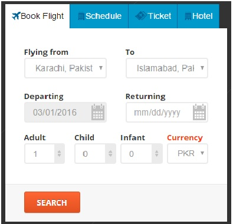

### CodeCamp # 5  
Nattharika Cheepandung  
 
 

# Homework #2

ให้สร้าง form ชื่อ booking.html โดยมีหน้าตาดังรูป 

<pre>
Note : 
1. ห้ามใช้ Bootstrap 
2. สนใจเฉพาะส่วนที่วงสีแดง
3. upload ขึ้น github.io 
</pre>