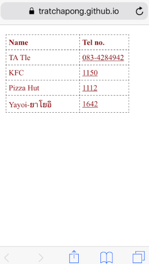

### CodeCamp # 5  
Nattharika Cheepandung  
 
 

# Homework #3

ให้สร้าง `phonebook.html` ในแบบ responsive 
เพื่อสร้างเป็นสมุดโทรศัพท์บน smart phone
โดยส่งไฟล์ไว้ที่ github.io

ใช้ web browser บน smartphone เข้าไปที่  url

<ชื่อ user>.github.io/phonebook.html

