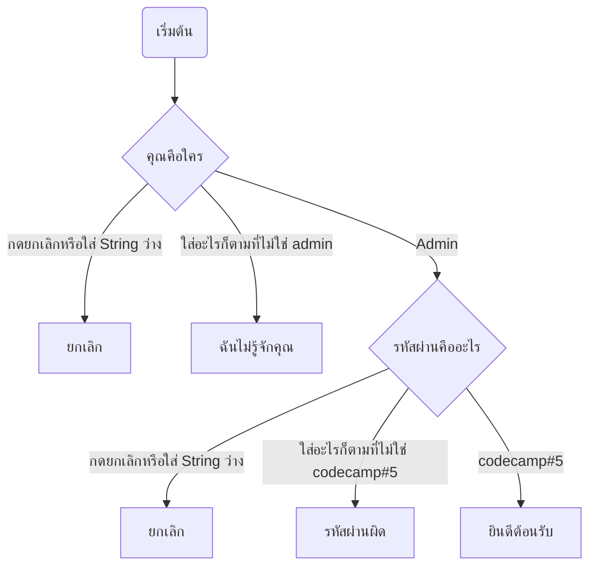

### CodeCamp # 5  
Nattharika Cheepandung  
 
 

# Exercise 1 #5 : ตัวดำเนินการแบบตรรกะ

**แบบฝึกหัด** 

    5. ให้เขียนระบบ login

ให้ใช้ prompt ในการถามใครเป็นคน login
- ถ้าผู้ใช้กรอกว่า “Admin” ให้ใช้ prompt ถาม password
- วิธีเช็ค Password
    - ถ้า string นั้นเป็น “codecamp#5” ให้ alert “ยินดีต้อนรับ”
    - ถ้า string เป็นอย่างอื่นให้ alert เป็น “Wrong password”
    - ถ้าเป็น string ว่าง หรือ กด cancel ให้ alert ว่า “ยกเลิก”
- ถ้าผู้ใช้กรอกอย่างอื่นที่ไม่ใช่ “Admin” ให้ alert ว่า “ผมไม่รู้จักคุณ”
- ถ้าผู้ใช้กรอก input เป็น string ว่าง หรือกด Esc ให้ alert ว่า “ยกเลิก”

 

***ให้เขียนระบบ login***

